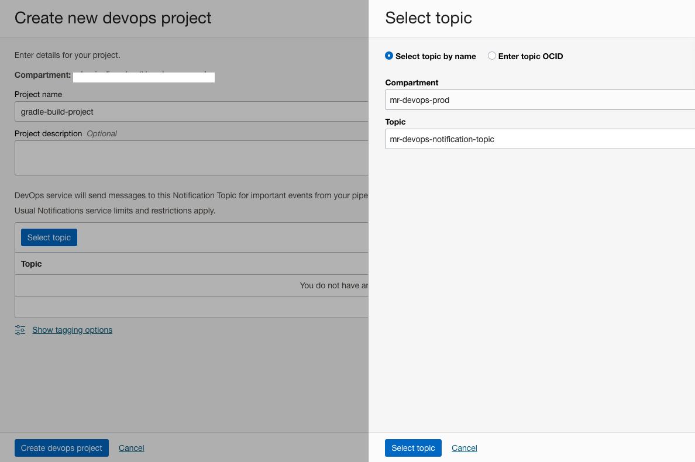
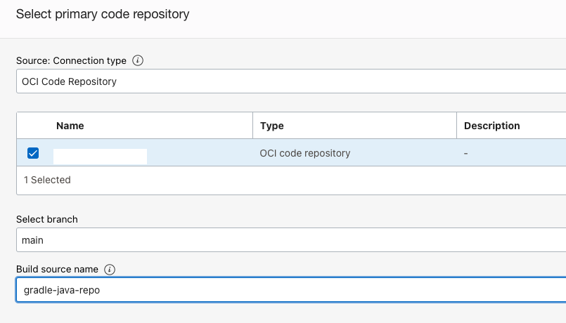

# OCI Devops Build pipeline - Build a java application using Gradle.

This sample shows how build and upload output artifact of a Java application using Gradle ,using OCI Buildpipeline.


## Objectives

- Create a devops project/code repo /buildpiepline .
- Run the test build and push the artifact to artifact repo.

## Procedure to use this illustration.

### OCI Access setups.

- Create an OCI Dynamic group and add the below rules. Replace <YOUR_COMPARMENT_OCID> with your compartment OCID. - https://docs.cloud.oracle.com/iaas/Content/Identity/Tasks/managingdynamicgroups.htm 

```java
ALL {resource.type = 'devopsbuildpipeline', resource.compartment.id = '<YOUR_COMPARMENT_OCID>'}
```

- Create an OCI policy and add the following policy statements. Replace <YOUR_DynamicGroup_NAME> with the name of your dynamic group for DevOps and with the name of your compartment. - https://docs.cloud.oracle.com/iaas/Content/Identity/Concepts/policies.htm

```java
Allow dynamic-group <YOUR_DynamicGroup_NAME> to manage ons-topics in compartment <YOUR_COMPARTMENT_NAME>
Allow dynamic-group <YOUR_DynamicGroup_NAME> to manage all-artifacts in compartment <YOUR_COMPARTMENT_NAME>
```

### OCI Notifications
- Create an OCI notification topic - https://docs.oracle.com/en-us/iaas/Content/Notification/Tasks/managingtopicsandsubscriptions.htm#createTopic

### OCI Artifact repo

- Create an OCI Artifact registry repo . - https://docs.oracle.com/en-us/iaas/Content/artifacts/manage-repos.htm#create-repo 
- You can enable or disable Immutable option as accordingly.We would prefer immutable artifacts


### OCI Devops Setup.

- Create an OCI notification topic - https://docs.oracle.com/en-us/iaas/Content/Notification/Tasks/managingtopicsandsubscriptions.htm#createTopic
- Create a DevOps project - https://docs.oracle.com/en-us/iaas/Content/devops/using/create_project.htm#create_a_project. Associate with the notification topic.



- Enable logging for the DevOps project.


- Click on Code Repository within the DevOps project resource and click on `Create repository. - https://docs.oracle.com/en-us/iaas/Content/devops/using/create_repo.htm


- Using the ssh or https method and push the whole content to the OCI Code repo - refer to details here - https://docs.oracle.com/en-us/iaas/Content/devops/using/clone_repo.htm

- Click on Build pipelines within DevOps project resources and click on Create build pipeline- https://docs.oracle.com/en-us/iaas/Content/devops/using/managing_build_pipelines.htm


- Use `+` and add a stage.


- Add a `Managed Build` stage.


- Use `Select` under the `Select primary code repository` option and select the Code repo created. 



- Click `Add`.

- Click `+` and add a stage with type as `Deliver artifacts` to the build pipeline. This stage will help to push the artifact to the OCI artifact repository. We will be pushing the outcome of the build (an executable app file) and the deployment manifest to the artifact repo. Provide a name and description.


- Click on `Create artifact`


- Provide a name, select type as `General artifact`. Using the select, select the artifact repo created.


- Use `Set a custom artifact location` and version as the Artifact location option.
- Provide Artifact path as `application.jar` and Version as `${BUILDRUN_HASH}` . This will create a build outcome with a dynamic version. Choose `Yes,substitue placeholders` option and click on Add


- Use config name as `application_jar` and associate with the artifact created.


- Add the stage.


### Test the buildpieline .

- Click `Start manual run` with in buildpipeline and do a test build . 


- Wait for all the stage to complete and once done you can verify the `Application Jar` file with in the artifact repo ,with a speciic tag.


References
==========

- Oracle Cloud Infrastructure DevOps - https://docs.oracle.com/en-us/iaas/Content/devops/using/home.htm

Contributors
===========

- Author: [Rahul M R](https://github.com/RahulMR42).
- Collaborators: NA
- Last release: September 2022
